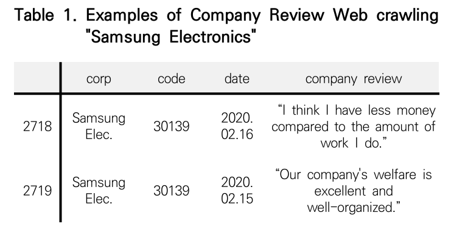
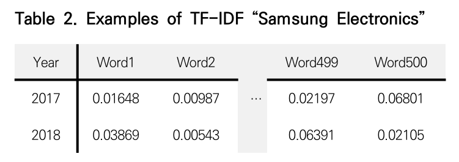
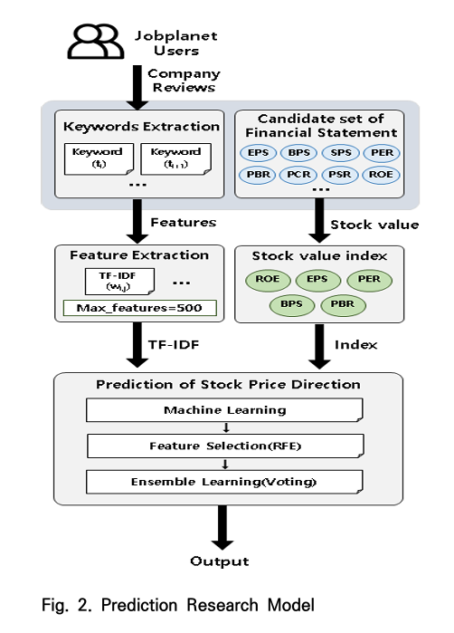
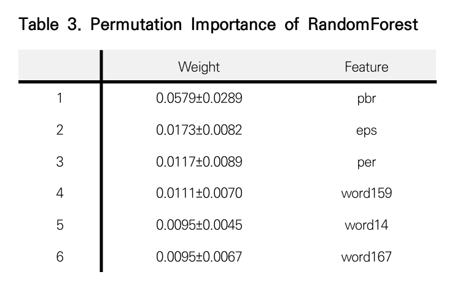
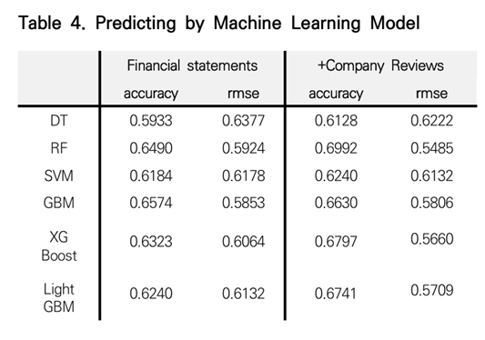
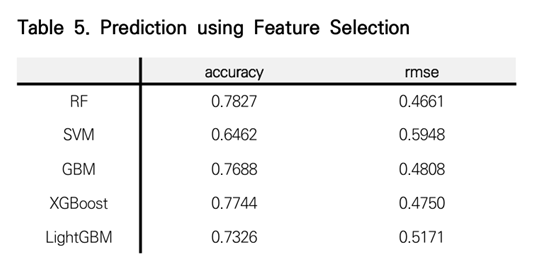
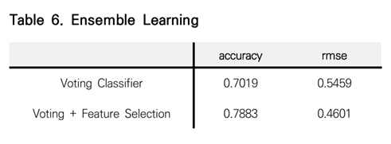

# 논문 제목 : 기업 리뷰 정보를 활용한 주가 방향 예측 모델 비교 분석

## 논문 요약
해당 연구는 비정형 데이터인 온라인 기업 리뷰를 텍스트 마이닝을 통해 스코어링 하여 머신러닝 기법을 통해 수치적 결과값을 도출하고 모델간 주가 방향 예측력을 비교, 분석하였음. 위 연구에서 사용한 내부 직원의 기업 리뷰를 사용한 모델은 최대 78.8%의 예측 정확도를 보이며 기존 연구와 차별성을 지님.

## 한 줄 요약
뉴스/sns 를 통한 주가 예측은 노이즈가 너무 많은데? 실무자 리뷰로 해볼까? -> 유의미한 차이 확인.

### 기존의 연구 -> 뉴스/기사의 감성분석을 통한 기업별 주가 방향 예측 모형
이전에는 온라인 뉴스에서 '명사'를 추출한 뒤 단어가 갖고 있는 뜻에 긍정, 부정 점수를 부여한 후 기업별 일별 뉴스에 대해서 스코어링을 한 후 실제 해당일의 주가 등락에 대해 예측함. -> 텍스트 마이닝을 통해 형태소의 극성을 분류하고 감성분석과 머신러닝 기법을 사용한 주가 예측 모형을 제시하였고, 주가지수 방향성 예측을 위한 도메인 맞춤형 감성사전 구축방안[6]에서는 말뭉치를 기반으로 주식시장에 특화된 감성사전을 구축을 진행하였음. 

BUT 수집된 뉴스 데이터에 해당 기업을 단순 언급하는 뉴스 이거나 주가 방향 예측에 필요한 경제적 의미가 없는 뉴스가 포함됨으로써 예측 정확도가 낮을 수 있는 한계점을 지니고 있었음.

## 본 연구의 가설
내부 직원의 기업 리뷰를 활용한 주가 예측 모델은 재무 정보만 이용한 모델보다 우수한 예측력을 가질 것이다.

### 데이터셋 설계 & 텍스트 마이닝
1. 텍스트 데이터인 기업 리뷰는 잡플래닛[13]에서 472개 기업의 74,291개 연도별 기업 리뷰를 수집

2. 수치형 데이터인 기업별 재무 정보는 네이버 금융[14]에서 기말기준 2016년부터 2019년까지 4개년도를 대상으로 776개 기업의 재무 정보를 수집
3. ROE(자기자본이익률), EPS(주당순이익), PER(주가수익비율), BPS(주당순자산가치), PBR(주가순자산비율)
    - 자기자본이익률(ROE) ＝ 당기순이익 / 평균 자기자본 ×100 (%)
    - 주당순이익(EPS) = 당기순이익 / 유통주식수
    - 주가수익비율(PER) = 주가 / 1주당 당기순이익
    - 주당순자산가치(BPS) = 순자산 / 발행주식수
    - 주가순자산비율(PBR) = 주가 / 주당순자산가치(BPS)
4. KoNLPy의 형태소 분석기 기반 tokenizer = 한국어 문장을 형태소(의미 있는 가장 작은 단위)로 잘라 주는 함수(예: 명사·동사 어간 등으로 쪼개기)
5. Scikit-learn의 TfidfVectorizer = 문서 모음을 받아서 TF-IDF 수치 벡터(단어별 중요도)를 만들어 주는 도구.

- *데이터셋은 재무 정보 특성 5개, 기업 리뷰 TF-IDF 키워드 500개로 총 505개 특성으로 구성하였고, 타켓 레이블은 전년 대비 해당년도 주가 방향(상승방향 +1, 하락방향 0)을 사용*

- TF (Term Frequency: 문서 안의 중요도) : tf(w,d): 단어 w가 문서 d에 등장한 빈도(비율)
- IDF (Inverse Document Frequency: 말뭉치에서의 희소성) : idf(w) = log( N / df(w) ): 전체 문서 수 N 중 w가 등장한 문서 수 df(w)의 역비율 로그
    -> 로그를 쓰는 이유는 희귀 단어와 흔한 단어의 격차가 너무 커지지 않게 맞춰주기 위해서(스케일 안정화)
- tfidf(w,d) = tf(w,d) × idf(w)

### 머신러닝 기법

1. 의사결정나무(DT)
    - 1. 데이터 쪼개기 질문 찾기: “PBR<1?” 같은 질문을 여러 후보 중에서 골라, 좌/우로 나눴을 때 클래스가 더 잘 섞이지 않게(순도↑) 만드는 질문을 선택
    - 2. 재귀적으로 분할: 나뭇가지마다 다시 “가장 잘 나누는 질문”을 골라 쪼개기 반복
    - 3. 잎(leaf)에서 예측: 마지막 잎에 도달하면, 그 잎에서 가장 많은 레이블(또는 평균값)로 예측
    - 4. 이 데이터에서의 역할: 기준선 + “규칙형” 신호 탐색. (성능: 재무만 0.593 → 리뷰추가 0.613)
2. 랜덤포레스트(RF)
    - 1. 부트스트랩 샘플링: 원본에서 뽑아 만든 여러 훈련 세트로 여러 그루의 나무를 각각 학습
    - 2. 무작위 특성 서브셋: 각 분할 시 사용할 특성 일부만 랜덤으로 골라 나무마다 다른 관점을 학습(나무들 상관↓)
    - 3. 집계: 모든 나무의 예측을 다수결/평균으로 합쳐 최종 예측(과대적합 완화, 안정성↑)
    - 4. 이 데이터에서의 역할: 재무 5개(낮은 차원, 뚜렷한 임계값) + 일부 강한 키워드 조합을 안정적으로 잡아줌

3. 서포트 벡터 머신(SVM)
    - 1. 경계선 상상: 두 클래스를 가르는 직선/평면 경계를 생각하고
    - 2. 간격(마진) 최대화: 경계와 가장 가까운 점들(서포트 벡터)까지의 거리를 최대로 하는 경계를 선택
    - 3. 곡선 경계도 OK: 데이터가 복잡하면 커널로 공간을 살짝 바꿔서, 결과적으로 직선으로 나누듯 분리
    - 4. 이 데이터에서의 역할: 대량의 희소 키워드가 만드는 전반적 방향성 경계(“긍/부정 어휘들의 총합”)를 글로벌하게 그어줌
4. 그래디언트 부스팅 머신(GMB)
    - 1. 약한 나무부터 시작: 작은 결정나무 하나로 대략 예측
    - 2. 틀린 부분 보완: 틀린 정도(오차/그라디언트)가 큰 데이터에 더 집중해 다음 작은 나무를 학습
    - 3. 조금씩 더하기: 이전 예측에 작은 비율(learning rate)로 새 나무를 더해가며, 여러 나무의 합이 최종 모델
    - 4. 이 데이터에서의 역할: 재무·키워드의 약한 개별 신호들을 축적해 엣지를 올림
5. XGBoost
    - 1. GBM의 고급형: 위 부스팅 흐름은 같되, 정규화(가중치 패널티)로 과대적합 억제
    - 2. 똑똑한 분할/가지치기: 손실 증가를 미리 예측해 불필요한 분할을 억제, 빠르게 최적 분할 찾기
    - 3. 결측·희소 최적화/샘플링: 결측값 경로 결정, 행·열 샘플링 등으로 속도·안정성 강화
    - 4. 이 데이터에서의 역할: 희소 키워드와 재무 임계값의 복합 규칙을 효율적으로 찾음
6. LightGBM
    - 1. 히스토그램化: 연속형 특성을 구간(bin)으로 묶어 분할 후보를 줄여 매우 빠르게 학습
    - 2. 잎(leaf)-우선 성장: 분할 이득이 가장 큰 잎을 먼저 깊게 키워 효율적으로 성능↑
    - 3. 희소·대용량 친화: 희소 특성 처리와 다양한 샘플링으로 대규모·고차원 데이터에 강함(단, 과적합 방지 파라미터 중요)
    - 4. 이 데이터에서의 역할: 피처 수가 많은 TF-IDF에서 속도·효율 이점, 조밀하지 않은 키워드도 잘 훑음

### 상호 보완 방법
- 배깅(RF)은 분산을 낮춰 안정성을 올리고, 부스팅(GBM/XGB/LGB)은 편향을 줄이며 미세신호를 끌어올려 줘. SVM은 고차원 희소 공간의 전역 경계를 잘 그린다.
- 이 오류 패턴이 서로 달라서 합치면 서로 못 본 걸 보완한다 → 논문도 Top4(RF/GBM/XGB/LGB) 하드보팅에서 0.7019, 보팅+특성선택에서 **0.7883(최고)**로 뛰었다고 보고(“한 분류기가 못한 것을 다른 분류기가 분류”).

---

- 순열 특성 중요도(Permutation Importance)
    - 트리 모델이 주는 기본 특성 중요도(분할로 불순도 감소량 합계)는 편향이 있음 -> 검증 세트에서 특성 A만 셔플해서 의미를 없앤 뒤 성능 하락폭을 본다 → 많이 떨어질수록 A가 진짜 중요한 특성
- 투표 기반 분류기(Voting Classifier)
    - 서로 성격이 다른 여러 모델을 같은 데이터로 따로 학습시킨 다음, 예측을 다수결로 합쳐서 최종 답을 내는 방식
    - 본 논문에서는 단일 모델들 중에서 성능이 좋았던 Top4: RF, GBM, XGBoost, LightGBM을 모아서 투표 분류기를 만들었음

## 연구 결과

1. 단일 모델(튜닝 완료) 비교: 재무만 vs 재무+리뷰
- 평균적으로 리뷰를 추가하면 정확도 +2.97%p, RMSE −0.0252만큼 개선.
- 모델별 예:
    - RF: 0.6490 → 0.6992, RMSE 0.5924 → 0.5485 (가장 큰 개선)
    - DT: 0.5933 → 0.6128 (개선)
    - XGBoost: 0.6323 → 0.6797 (개선)
    - LightGBM: 0.5709 → 0.6132, 다만 RMSE는 악화(0.6240→0.6741) → 지표별 엇갈림 주의.
- 리뷰(내부 직원 평가)가 방향성 신호로 유의미하며, 특히 RF가 가장 잘 일반화함

2. 특성선택(순열 중요도→상위90%→RFE) 후 단일 모델
- RF 0.7827 (RMSE 0.4661), XGBoost 0.7744, GBM 0.7688, LightGBM 0.7326, SVM 0.6462.
- 중요 특성만 남겨 노이즈 제거 → 성능 큰 폭 개선(1차 결과보다 전반 상승)

3. 앙상블(투표 분류기)
- Voting(Top4): 정확도 0.7019, RMSE 0.5459
- Voting + 특성선택: 정확도 0.7883, RMSE 0.4601(본 연구 최고 성능)
- 개별 모델의 약점을 서로 보완해 단일 모델 이상의 성능을 보였고, 특성선택을 결합하면 최고치에 도달. “한 분류기가 못한 것을 다른 분류기가 분류”한 결과로 설명

4. 성과
- 기존 주가 방향 예측 연구에서 시도하지 않았던 종업원의 기업 리뷰 데이터를 활용함으로써 주가 방향 예측 모델의 예측력이 향상될 수 있음
- 실제 모형을 통해 종업원 만족도를 나타내는 기업 리뷰 데이터가 기업의 수익성 및 재무성과를 반영한다는 점을 밝혔으며, 잡플래닛의 기업 리뷰가 주가 방향 예측 연구의 데이터로서의 안정성 및 일반화가 가능함을 확인

5. 한계점
- 기말 기준의 주가의 상승, 하락을 분류하는 예측 결과를 도출하였기 때문에 시계열분석 관점에서 연속적인 날짜의 데이터는 사용하지 않은 점과 KOSPI 상장기업에 대해서만 실험이 이루어졌다는 점
- 이번 연구에서는 빈도 기반의 TF-IDF를 통해 기업 리뷰를 구성하는 키워드 중 연도별로 이슈화되고 많이 언급되는 키워드의 집합을 추출하여 사용하였으나, word2vec을 통한 단어 간 유사도까지 연구 범위에 포함하여 고려하지 못함